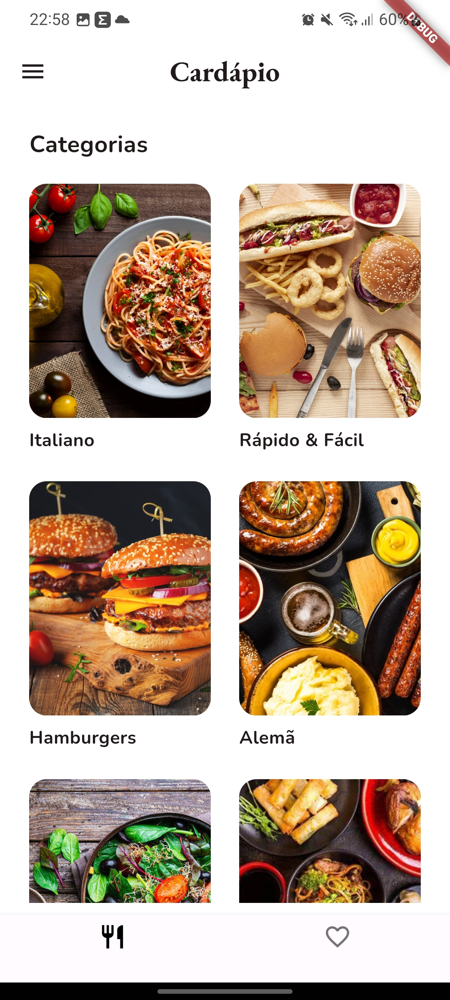
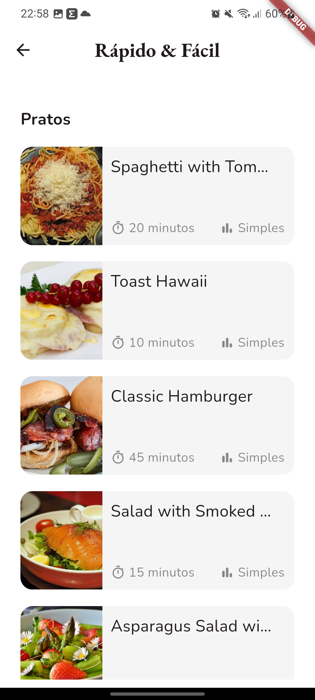
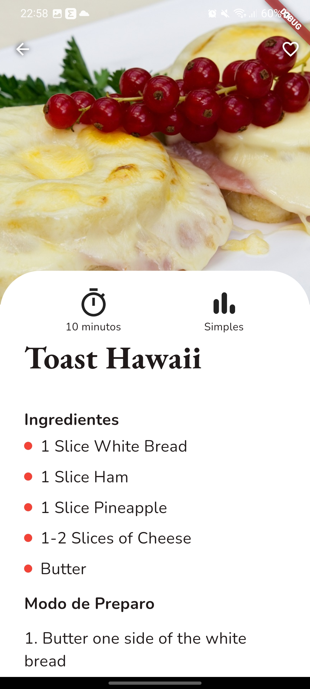
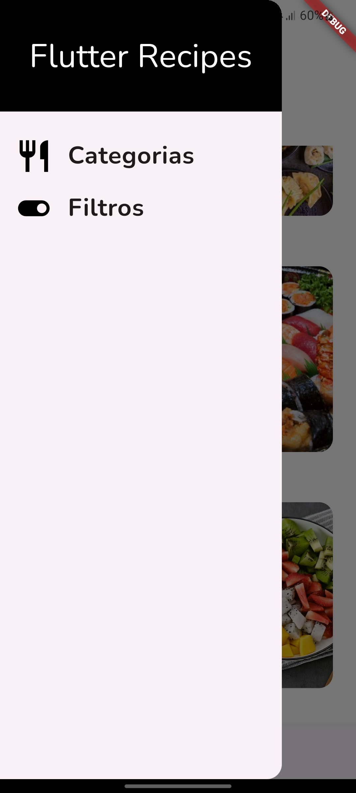
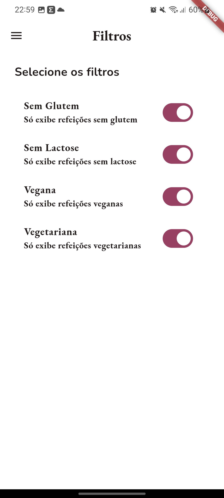

<p align="center">
  

  
  
  <a href="https://github.com/gabshs/recipes-flutter/commits/main">
    
  </a>
    
   
   <a href="https://github.com/gabshs/recipes-flutter/stargazers">
    
  </a>  
 
</p>
<h1 align="center">
    Recipes Flutter
</h1>

<h4 align="center"> 
	🚧  Concluído 🚀 🚧
</h4>

<p align="center">
 <a href="#-sobre-o-projeto">Sobre</a> •
 <a href="#-funcionalidades">Funcionalidades</a> •
 <a href="#-layout">Layout</a> • 
 <a href="#-como-executar-o-projeto">Como executar</a> • 
 <a href="#-tecnologias">Tecnologias</a> • 
 <a href="#-contribuidores">Contribuidores</a> • 
 <a href="#-autor">Autor</a> • 
 <a href="#user-content--licença">Licença</a>
</p>


## 💻 Sobre o projeto

Recipes - é um app para descobrir novas receitas e se deliciar na cozinha.

Projeto é uma nova estilização ao app desenvolvido no curso de **Flutter** oferecido pela [Cod3r](https://www.udemy.com/course/curso-flutter/).
O curso possui um módulo onde ensina paginações e desenvolve um app de receitas chamado meals.

---

## 🎨 Layout

O layout da aplicação está disponível no Figma:

<a href="https://www.figma.com/file/zNdIIODeN7NJ1RzVRHWDS8/Meals-Flutter?type=design&node-id=0%3A1&mode=design&t=OsTRAdfKPnLL38HF-1">
  
</a>


### Mobile

<p align="center">
  
  
  
  
  
</p>

---

## 🚀 Como executar o projeto

### Pré-requisitos

Antes de começar, você vai precisar ter instalado em sua máquina as seguintes ferramentas:
[Git](https://git-scm.com), [Flutter](https://docs.flutter.dev/get-started/install). 
Além disto é bom ter um editor para trabalhar com o código como [VSCode](https://code.visualstudio.com/)


```bash

# Clone este repositório
$ git clone git@github.com:gabshs/recipes-flutter.git

# Acesse a pasta do projeto no seu terminal/cmd
$ cd recipes-flutter

# Instale as dependências
$ flutter pub get

# Execute a aplicação
$ flutter run

# A aplicação será aberta em um simulador de sua preferência

```

---

## 🛠 Tecnologias

As seguintes ferramentas foram usadas na construção do projeto:

([Dart](https://dart.dev/)  +  [Flutter](https://flutter.dev/))

> Veja o arquivo  [pubspec.yaml](https://github.com/gabshs/recipes-flutter/blob/main/pubspec.yaml)


#### [](https://github.com/tgmarinho/Ecoleta#utilit%C3%A1rios)**Utilitários**

-   Protótipo:  **[Figma](https://www.figma.com/)**  →  **[Protótipo (Flutter Recipes)](https://www.figma.com/file/zNdIIODeN7NJ1RzVRHWDS8/Meals-Flutter?type=design&node-id=0%3A1&mode=design&t=SwNCWzg71DlDwFBi-1)**

-   Fontes:  **[EB Garamond](https://fonts.google.com/specimen/EB+Garamond)**,  **[Nunito](https://fonts.google.com/specimen/Nunito)**


---

## 👨‍💻 Contribuidores

💜 Um super thanks 👏 para esse super designer que me ajudou a reformular algumas telas, para ficarem ainda mais bonitas :)

<table>
  <tr>
    <td align="center"><a href="https://www.linkedin.com/in/wtonfers/"><br /><sub><b>Wellington Ferreira</b></sub></a><br /><a href="https://www.linkedin.com/in/wtonfers/" title="Linkedin wtonfers">👨‍🚀</a></td>
    
    
  </tr>
  
</table>

## 🦸 Autor

<a href="https://www.linkedin.com/in/gabshs/"><br /><sub><b>Gabriel Henrique</b></sub></a><br /><a href="https://www.linkedin.com/in/gabshs/" title="linkedin gabshs"></a>

 [](https://www.linkedin.com/in/gabshs/) 

---

Feito com ❤️ por Gabriel Henrique 👋🏽 [Entre em contato!](https://www.linkedin.com/in/gabshs/)
